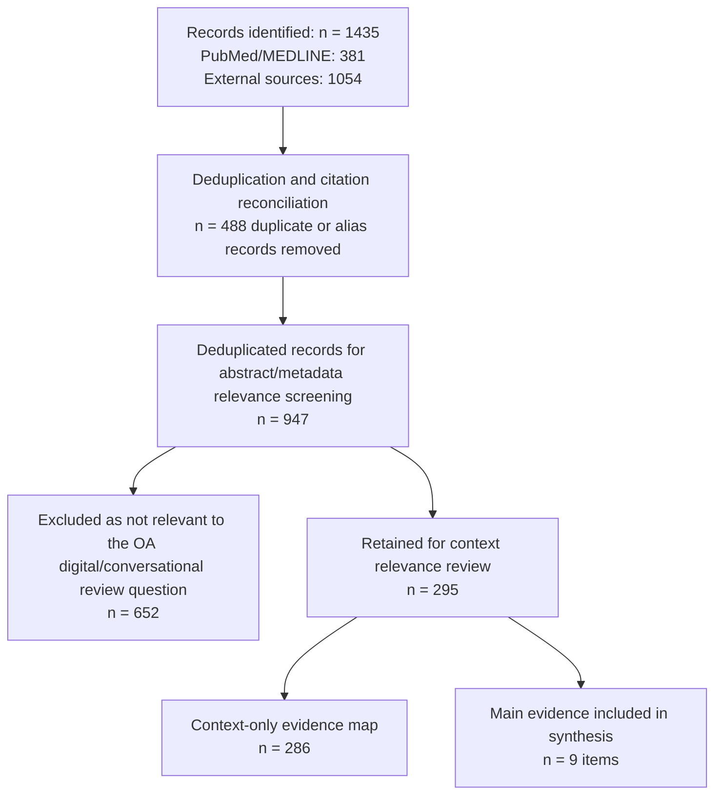

# Patient-Facing Voice and Conversational Agents for Osteoarthritis Home Monitoring: A Scoping Review

## Abstract

**Background:** Osteoarthritis (OA) symptoms fluctuate outside clinic visits, where patients manage pain, function, treatment use, and possible warning symptoms. Voice assistants, chatbots, and other conversational systems may reduce reporting burden and support home monitoring, but the evidence is scattered across rehabilitation, digital health, and AI literature.

**Objective:** To map published and registered evidence on patient-facing voice assistants, chatbots, conversational agents, virtual assistants, and AI-guided interactive systems relevant to OA monitoring, self-management, rehabilitation, or pre-consultation support, and to identify gaps relevant to an OA home pain check-in assistant.

**Methods:** The review used the Population-Concept-Context framework and followed a PRISMA-ScR-informed structure. PubMed/MEDLINE was searched directly. Records exported from Embase, EBSCO/CINAHL, IEEE Xplore, ACM Digital Library, Scopus, Google Scholar, and website-based sources were imported. Records were deduplicated by DOI, normalized title, and final citation reconciliation, then screened for abstract/metadata relevance and classified as context-only evidence or main evidence.

**Results:** The combined search and import process identified 1,435 raw records: PubMed/MEDLINE (n = 381) and external sources (n = 1,054). Deduplication and citation reconciliation removed 488 duplicate or alias records, leaving 947 deduplicated records for abstract/metadata relevance screening. Screening excluded 652 records that did not meet the OA digital or conversational review concept, leaving 295 records for context relevance review. Context relevance review classified these as 286 context-only records and 9 main-evidence items. Of these, 6 had published full-text, conference, or protocol reports available for detailed charting and 3 were registry-only planned or ongoing studies. The evidence clusters around virtual-assistant history taking, patient-facing digital support, chatbot- or LLM-guided rehabilitation, planned OA chatbot trials, and perioperative OA-adjacent conversational support, not longitudinal OA home pain check-ins.

**Conclusion:** OA digital-health evidence is broad, and a small OA-relevant conversational/LLM evidence set exists. However, no identified study clearly evaluates an OA-specific home pain check-in voice assistant that combines pain/function capture, treatment and side-effect context, red-flag escalation, privacy-aware speech handling, and clinician-readable handoff.

## 1. Introduction

### 1.1 Clinical Background: Osteoarthritis and Home Monitoring

Osteoarthritis (OA) is a common long-term joint condition and a major contributor to pain, functional limitation, reduced mobility, sleep disturbance, and reduced quality of life in adults and older adults. Much of its burden is experienced outside clinic visits, where patients make daily decisions about exercise, analgesic use, self-management, and when to seek care. Because OA symptoms fluctuate over time, a single clinic visit may not capture the patient’s usual pain pattern, functional limitations, treatment response, or emerging concerns.

Home monitoring is therefore clinically relevant. Useful OA monitoring may include pain severity, pain location, comparison with the patient’s baseline, functional impact, medication or treatment use, adverse effects, and new symptoms that may need escalation. Numeric pain scores alone are often insufficient. Clinically useful monitoring usually needs context: what the patient can or cannot do, whether pain is worse than usual, whether treatment changed recently, and whether there are red-flag features that should trigger review.

For older adults or people with limited digital literacy, voice-based monitoring may lower reporting burden compared with forms or dense app interfaces. At the same time, speech-based systems create specific risks: transcription errors, misunderstanding of safety-critical symptoms, privacy concerns related to audio capture, and uncertainty about who reviews the output and when.

### 1.2 Digital Health and Conversational Agents in Patient Monitoring

Digital health tools are increasingly used to collect patient-reported outcomes, support self-management, and extend care beyond face-to-face visits. Within this broader field, chatbots, voice assistants, and other conversational systems offer a more interactive approach than static forms. They can ask one question at a time, clarify unclear answers, adapt language to the user, and generate structured summaries.

Medical conversational systems vary widely. Some are rule-based. Others use natural language understanding, speech recognition, large language models, retrieval pipelines, or hybrid architectures. Their clinical roles also differ: education, pre-consultation intake, symptom collection, rehabilitation guidance, decision support, or free-text question answering. These distinctions matter because fluent dialogue is not the same as safe symptom monitoring.

For OA, a patient-facing conversational monitoring system may need to perform several functions safely: capture pain and function, contextualize symptom severity, identify current treatments, screen for adverse effects or new symptoms, recognize urgent red flags, avoid overstepping into unsafe advice, and produce a concise handoff for clinician review. The OA Home Pain Check-in Assistant in this project is motivated by that safety-oriented use case.

### 1.3 Rationale for Conducting a Scoping Review

A scoping review is appropriate when a literature base is broad, heterogeneous, emerging, or not yet ready for pooled-effect synthesis. The evidence relevant to OA conversational monitoring spans OA care, rehabilitation, telemonitoring, mobile health, patient-reported outcomes, medical chatbots, voice assistants, and AI-supported guidance. These fields use inconsistent terminology and evaluate different outcomes, making it difficult to see what has already been studied and where the gaps remain.

The purpose of this review is therefore to map the existing evidence rather than estimate a pooled intervention effect. The review asks what types of patient-facing conversational or voice-based systems have been studied in OA, what clinical roles they perform, how safety and clinician handoff are handled, and what study designs and outcomes have been reported. It is also intended to justify and sharpen the role of the present OA voice-assistant project.

### 1.4 Objectives and Research Questions

The objective of this scoping review is to map published and registered evidence on patient-facing voice assistants, chatbots, conversational agents, and related AI-supported interactive systems for OA monitoring, self-management, rehabilitation, or pre-consultation support.

The review question is structured using the PCC framework:

| PCC element | Definition for this review                                                                                                                                                               |
| ----------- | ---------------------------------------------------------------------------------------------------------------------------------------------------------------------------------------- |
| Population  | Adults or older adults with osteoarthritis or degenerative knee disease in OA-relevant care pathways                                                                                     |
| Concept     | Patient-facing voice assistants, chatbots, conversational agents, virtual assistants, AI-supported symptom check-ins, AI-guided rehabilitation, or interactive remote-monitoring systems |
| Context     | Home, community, rehabilitation, telehealth, outpatient follow-up, pre-consultation assessment, or related OA self-management contexts                                                   |

The research questions are:

1. What types of patient-facing conversational or voice-based systems have been studied in OA or OA-adjacent care?
2. What populations, settings, and clinical roles are represented in the existing literature?
3. What clinical information do these systems collect or act on, including pain, function, treatment context, rehabilitation tasks, or patient-reported outcomes?
4. How do included systems address safety, escalation, privacy, and clinician handoff?
5. What study designs and evaluation outcomes have been used?
6. What gaps remain for the development of an OA home pain check-in assistant?

## 2. Methods

### 2.1 Design and Reporting Guideline: PRISMA-ScR

This work was conducted as a scoping review/evidence map because the aim was to describe the breadth, characteristics, and gaps of the literature rather than estimate a pooled intervention effect. The review was structured around the Population-Concept-Context framework and followed a PRISMA-ScR-informed structure.

No meta-analysis was performed. Formal risk-of-bias scoring was not used as an exclusion criterion because the purpose was to map evidence availability and design gaps rather than to produce an effectiveness estimate.

### 2.2 Eligibility Criteria Using PCC

Eligibility criteria were defined using the PCC framework.

| PCC element | Inclusion criteria                                                                                                                                                                              | Exclusion criteria                                                                                                                                                                               |
| ----------- | ----------------------------------------------------------------------------------------------------------------------------------------------------------------------------------------------- | ------------------------------------------------------------------------------------------------------------------------------------------------------------------------------------------------ |
| Population  | Adults or older adults with OA, including knee or hip OA, or clearly OA-relevant degenerative knee disease                                                                                      | Pediatric-only populations; non-OA pain populations; rheumatoid arthritis or unrelated chronic disease populations; clearly non-OA cohorts                                                       |
| Concept     | Patient-facing voice assistants, chatbots, conversational agents, virtual assistants, AI-supported interactive tools, LLM-guided rehabilitation tools, or OA-relevant remote monitoring systems | Clinician-only decision support; imaging-only or diagnostic-only AI; non-interactive digital tools with no patient-facing component; general AI benchmarking without OA patient-facing relevance |
| Context     | Home, rehabilitation, telehealth, outpatient follow-up, pre-consultation, remote monitoring, or OA self-management settings                                                                     | Purely inpatient or laboratory-only settings with no patient-facing OA relevance                                                                                                                 |

The main-review concept was narrower than the broader context appendix. Main evidence required OA-relevant patient-facing conversational, virtual-assistant, chatbot, LLM-guided, or closely adjacent interactive evidence. OA apps, wearables, telehealth, ePRO platforms, and other digital-health tools without a conversational or closely interactive component were retained as context-only evidence.

### 2.3 Information Sources

The review used PubMed/MEDLINE plus external records from Embase, EBSCO/CINAHL, IEEE Xplore, ACM Digital Library, Scopus, Google Scholar, and several website-based citation collections. Website-based citation collections were grouped under the generic `External` source label.

The imported external records contributed the following raw source counts:

- Embase: 500
- Scopus: 299
- External miscellaneous sources, including Google Scholar and website-based collections: 117
- ACM Digital Library: 58
- EBSCO/CINAHL: 50
- IEEE Xplore: 30

### 2.4 Search Strategy

The PubMed search combined OA terms, conversational or digital-health technology terms, and pain/symptom/function/self-management terms. The working PubMed strategy was:

```text
("Osteoarthritis"[Mesh] OR osteoarthritis OR osteoarthrosis OR "degenerative joint disease" OR "degenerative arthritis")
AND
(chatbot* OR "conversational agent*" OR "voice assistant*" OR "virtual assistant*" OR "speech interface*" OR "spoken dialogue system*" OR "remote monitoring" OR telemonitoring OR mHealth OR "mobile health" OR smartphone OR "mobile app")
AND
(pain OR symptom* OR function* OR "self-management" OR "patient-reported outcome*" OR monitoring OR rehabilitation)
```

External database searches used adapted shorter Boolean strings because some engineering databases did not return results with the longer medical-style PubMed query. The export files were retained as the search audit trail.

### 2.5 Source Selection

Records were filtered in three main steps. First, duplicate records were removed before screening to avoid double-counting the same citation across databases. Matching used normalized DOI first; records without DOI were then matched by normalized title after lowercasing, punctuation removal, whitespace normalization, and removal of common title stop words. External records matching a PubMed DOI or title were counted as PubMed overlaps and removed from the external screening denominator. Final citation reconciliation also consolidated obvious aliases of the same study before manuscript counts were reported.

Second, the deduplicated records underwent abstract/metadata relevance screening against the PCC criteria. Records were excluded if they lacked OA relevance, were review/background records only, focused on non-OA populations, were diagnostic or clinician-facing only, or did not contain a patient-facing digital, monitoring, rehabilitation, chatbot, voice-assistant, virtual-assistant, or LLM-guided concept relevant to the review question.

Third, retained records underwent context relevance review. Records describing OA digital health, telehealth, apps, wearables, electronic patient-reported outcomes, or remote-monitoring evidence without a patient-facing conversational/LLM/voice or closely interactive component were retained as context-only evidence. Records describing OA-relevant patient-facing chatbot, virtual-assistant, voice-assistant, LLM-guided, or closely adjacent interactive systems were reviewed as main evidence. PubMed decisions were audited by a second reviewer with no reported disagreements, and the final 9 main-evidence studies were manually reviewed and accepted.

An internal model-assisted audit was used after screening to flag potentially missed main-evidence records. It is not reported as a separate filtration stage.

### 2.6 Data Charting

Charting fields included source database, record type, year, title, DOI, abstract, OA signal, conversational or voice signal, patient-facing signal, technology category, clinical content, safety/privacy/handoff signals, evaluation outcomes, and eligibility decisions.

The final charting outputs were a 9-item main-evidence table, a 286-record context-only evidence appendix, a PRISMA-style flow summary, and a main-evidence reference list.

### 2.7 Synthesis Method

The synthesis was descriptive and thematic. Counts were used to describe record distribution, technology categories, clinical content, safety/privacy/handoff signals, and evaluation outcomes. These counts were not interpreted as treatment-effect estimates.

The narrative synthesis grouped evidence into search results, characteristics of main-evidence studies, technology categories, clinical assessment content, safety/privacy/handoff content, evaluation outcomes, design implications for an OA voice assistant, knowledge gaps, and limitations.

## 3. Results

### 3.1 Search Results and PRISMA Flow Diagram

The combined search and import process identified 1,435 raw records: 381 from PubMed/MEDLINE and 1,054 from external sources. Deduplication and citation reconciliation removed 488 duplicate or alias records, leaving 947 deduplicated records for abstract/metadata relevance screening.

The filtration pathway was:

| Stage                                                        |     Count | Interpretation                                                                                                  |
| ------------------------------------------------------------ | --------: | --------------------------------------------------------------------------------------------------------------- |
| Raw records identified                                       |     1,435 | All database and website-exported records before cleaning                                                       |
| Duplicate or alias records removed                           |       488 | Duplicate external records, PubMed overlaps, or citation aliases identified during reconciliation               |
| Deduplicated records screened                                |       947 | Records assessed for abstract/metadata relevance to the review question                                         |
| Records excluded after abstract/metadata relevance screening |       652 | Records not relevant to OA digital/conversational monitoring or self-management                                 |
| Records retained for context relevance review                |       295 | OA digital-health or conversational/LLM/interactive records requiring charting                                  |
| Context-only evidence mapped                                 |       286 | Broad OA digital-health records retained for appendix and comparison                                            |
| Final main evidence                                          |   9 items | Human-confirmed OA-relevant conversational, LLM-guided, or closely adjacent patient-facing interactive evidence, including registry-only planned studies |

Figure 1 provides the PRISMA-style flow used for this review.



In summary, 1,435 raw records were reduced to 947 deduplicated records; abstract/metadata relevance screening narrowed these to 295 records for context relevance review; context relevance review produced 286 context-only records and 9 main-evidence items.

### 3.2 Characteristics of Main-Evidence Studies

The final main-evidence set contains 9 items after citation reconciliation and study-level deduplication: 6 published full-text, conference, or protocol reports available for detailed charting, and 3 registry-only planned or ongoing studies. Registry-only items were used to map current research activity and planned outcomes, not to make claims about completed intervention effects.

Table 1 summarizes the 9 main-evidence items.

| Study                                                     | Year | Evidence status                                  | Population                                                                                                            | Design                                                             | Technology                                                                                                    | Clinical function                                                                                     | Evidence role                                                                           |
| --------------------------------------------------------- | ---- | ------------------------------------------------ | --------------------------------------------------------------------------------------------------------------------- | ------------------------------------------------------------------ | ------------------------------------------------------------------------------------------------------------- | ----------------------------------------------------------------------------------------------------- | --------------------------------------------------------------------------------------- |
| alley ortho companion                                     | 2022 | Published protocol/full text                     | Patients with knee or hip osteoarthritis                                                                              | Randomized controlled multicenter trial protocol                   | Patient-facing eHealth/mobile app                                                                             | Information, organization, and emotional or empowerment support around orthopedic care                | OA-adjacent digital support; retained as patient-facing interactive OA support evidence |
| LLM dialogue system for perioperative anxiety             | 2025 | Published RCT/full text                          | Patients with osteoarthritis undergoing total knee replacement                                                        | Prospective randomized controlled pilot trial                      | ChatGPT-assisted informed-consent conversation                                                                | Perioperative anxiety reduction and patient education during total knee arthroplasty consent          | OA-adjacent perioperative conversational evidence                                       |
| NLP/chatbot tool for home rehabilitation adherence        | 2024 | Conference abstract available                    | Osteoarthritis patients after major joint replacement surgeries                                                       | Randomized clinical trial abstract                                 | Smartphone chatbot or natural-language-processing tool                                                        | Exercise recommendations and compliance tracking for home rehabilitation                              | OA-adjacent postoperative rehabilitation chatbot evidence                               |
| LINE chatbot after total knee arthroplasty                | 2024 | Registry-only planned/ongoing study              | Osteoarthritis patients after total knee arthroplasty                                                                 | Randomized controlled trial registry record                        | LINE mobile chatbot                                                                                           | Rehabilitation instructions after total knee arthroplasty                                             | Registered OA-adjacent chatbot rehabilitation study; no completed paper identified      |
| Virtual assistant for orthopedic consultation preparation | 2026 | Published full text                              | Older adults referred for knee or hip osteoarthritis                                                                  | Feasibility and acceptability study                                | Avatar-based virtual assistant using speech recognition, Google Dialogflow, rule-based logic, and ChatGPT 3.5 | Patient history taking before face-to-face orthopedic consultation                                    | Closest direct OA virtual-assistant evidence                                            |
| LLM chatbot for knee OA exercise adherence                | 2025 | Published full text                              | People with knee osteoarthritis                                                                                       | System development study                                           | Large-language-model chatbot with retrieval/reasoning methods                                                 | Evidence-based guidance and adherence support for exercise treatment                                  | Direct OA chatbot system-development evidence                                           |
| CHAT-OA                                                   | 2024 | Registry-only planned/ongoing study              | Patients with hip or knee osteoarthritis                                                                              | Planned/open clinical trial registry record                        | Generative-AI chatbot                                                                                         | Decision-making support, health literacy, anxiety, decisional conflict, and patient-reported outcomes | Registered direct OA chatbot trial; no completed paper identified                       |
| LLM-guided rehabilitation for degenerative knee disease   | 2025 | Registry-only planned/ongoing study              | Adults with degenerative knee disease, including knee OA relevance                                                    | Randomized four-arm clinical trial registry record                 | ChatGPT-5, Gemini 2.5 Pro, and DeepSeek V3.1 assisted exercise prescription                                   | LLM-assisted rehabilitation-program planning reviewed by physiotherapists                             | Registered OA-relevant LLM-guided rehabilitation trial; no completed paper identified   |
| DeepTherapy                                               | 2025 | Published full text                              | Osteoarthritis rehabilitation context; exported abstract reports OA patient evaluation and physiotherapist evaluation | AI platform development/evaluation study                           | Mobile platform using deep learning exercise analysis and LLM feedback                                        | Movement assessment, incorrect movement identification, and corrective rehabilitation feedback        | OA AI-guided rehabilitation platform evidence                                           |

The study-level evidence map shows that the main evidence is adjacent rather than directly matched to the planned OA Home Pain Check-in Assistant. The closest direct completed study is the virtual-assistant history-taking feasibility study in older adults with knee or hip OA. Other evidence focuses on patient-facing digital perioperative support, chatbot or LLM-supported decision-making, exercise adherence, rehabilitation planning, postoperative rehabilitation, perioperative anxiety, or AI-guided movement feedback. Registry-only items show planned work but do not provide completed results. None clearly evaluates repeated home pain check-ins with red-flag escalation and clinician-readable handoff.

### 3.3 Technology Categories

The broader external evidence map shows that OA digital health is dominated by non-conversational technologies. Among the deduplicated external records, non-exclusive title/abstract/keyword technology signals were:

- Mobile app or smartphone: 311
- Wearable sensor or activity tracker: 128
- Telehealth or telerehabilitation: 111
- Electronic patient-reported outcome: 81
- Imaging or diagnostic AI: 81
- Web or internet systems: 66
- Telephone or SMS: 39
- Chatbot or conversational agent: 35

Within the main-evidence set, the most relevant technologies were chatbots, virtual assistants, patient-facing digital support, LLM-guided rehabilitation planning, and AI-supported mobile rehabilitation platforms.

### 3.4 Clinical Assessment Content

The surrounding OA digital-health literature frequently targets function, treatment use, exercise, quality of life, pain, and adherence. The context-only appendix contains 286 records. Among the deduplicated external records, non-exclusive clinical-content signals were:

- Function or disability: 280
- Medication or treatment use: 277
- Physical activity or exercise: 215
- Quality of life: 181
- Pain intensity: 158
- Adherence or engagement: 136
- Mental health or sleep: 95
- Pain location or flare: 7

However, the main-evidence studies do not yet demonstrate a complete OA home monitoring workflow that combines pain severity, baseline comparison, functional anchors, treatment context, side effects, and escalation triggers in a single patient-facing conversational system.

### 3.5 Safety, Privacy, and Clinician Handoff

Among the deduplicated external records, non-exclusive safety/privacy/handoff signals were:

- Clinician review or handoff: 290
- Adverse events or harms: 85
- Ethics or consent: 57
- Privacy or confidentiality: 27
- Red-flag or escalation: 21

These counts come from title, abstract, and keyword signals and should not be overinterpreted as proof of an evaluated escalation workflow. In the main-evidence set, explicit reporting of red-flag logic, unsafe-advice controls, clinician handoff timing, transcript auditability, or audio privacy architecture remains sparse.

### 3.6 Evaluation Outcomes

Among the deduplicated external records, non-exclusive evaluation-outcome signals were:

- Clinical effectiveness: 239
- Implementation or workflow: 149
- Feasibility or acceptability: 147
- Usability or user experience: 121
- Technical performance: 114
- Adherence or engagement: 111

In the main-evidence studies, evaluation focuses appear to include feasibility and acceptability, rehabilitation adherence, clinical outcomes in planned trials, answer guidance, and pre-consultation intake support. Direct evidence on voice-first repeated home monitoring, red-flag detection accuracy, and clinician workflow impact remains limited.

## 4. Discussion

### 4.1 Main Evidence Map

The combined evidence map shows a small OA-relevant conversational/LLM evidence base. The main-evidence items include published or abstract evidence on virtual-assistant history taking, LLM/chatbot-supported rehabilitation, perioperative AI-supported education, and AI-supported rehabilitation platforms, plus registry-only planned studies of OA chatbot or LLM-guided rehabilitation interventions.

The evidence remains narrow and indirect for the OA Home Pain Check-in Assistant. Much of the surrounding literature is non-conversational digital health. Several main-evidence items are protocols, registry-only planned studies, perioperative OA-adjacent studies, or rehabilitation-guidance tools rather than longitudinal symptom check-in systems. None clearly matches the full intended role of an OA home pain check-in assistant.

### 4.2 Implications for OA Voice Assistant Design

The project should therefore be justified as a novel integration built on adjacent evidence, not as a straightforward replication of a well-established intervention class. The current evidence supports the relevance of:

1. Patient-facing AI interaction in OA-relevant settings
2. Rehabilitation guidance and adherence support
3. Pre-consultation conversational intake
4. Broader OA digital-health measurement domains such as pain, function, quality of life, exercise, and treatment use

But the project still needs to design and evaluate directly:

1. Brief voice-first interaction suitable for older adults
2. Deterministic red-flag escalation rules
3. Bounded LLM roles rather than free medical advice
4. Clear clinician handoff outputs
5. Privacy-preserving handling of speech and transcripts

### 4.3 Knowledge Gaps

The main gaps remain:

- No clearly identified OA-specific home pain check-in voice assistant study
- Limited evidence on repeated speech-first symptom monitoring in OA
- Sparse reporting of red-flag screening and escalation workflows
- Sparse reporting of privacy architecture for audio-based OA tools
- Limited evidence that conversational systems collect a clinically complete OA pain picture
- Limited evidence on clinician-facing report accuracy and workflow value
- Limited multilingual or culturally adapted evidence

### 4.4 Limitations

This review has several limitations. First, the external evidence map depends on exported records and therefore on the completeness and quality of those exports. Second, Google Scholar and website-based citation collections were imported through generic formats and may contain inconsistent metadata. Third, model-assisted adjudication was used only as an internal audit aid after screening and did not replace human review. Fourth, some included main-evidence items are protocol, registry-only, conference, or metadata-heavy records rather than completed full reports. Fifth, several main-evidence studies are perioperative or rehabilitation-adjacent rather than direct home-monitoring evaluations.

## 5. Conclusion

The combined evidence map supports the role of the OA Home Pain Check-in Assistant with a specific gap claim. OA digital-health evidence is broad, and a small OA-relevant conversational/LLM evidence base is visible across PubMed and external sources. However, the available evidence clusters around pre-consultation intake, chatbot or LLM-guided rehabilitation, planned chatbot trials, perioperative OA-adjacent interaction, and AI-supported rehabilitation feedback.

No identified study clearly evaluates an OA-specific home pain check-in voice assistant that combines pain/function capture, treatment and side-effect context, red-flag escalation, privacy-aware speech handling, and clinician-readable handoff. The project is therefore justified as a gap-filling prototype that needs direct prospective evaluation rather than as a replication of an established intervention.

## Main Evidence References

1. Strahl A, Graichen H, Haas H, Hube R, Perka C, Rolvien T, et al. Evaluation of the patient-accompanying app alley ortho companion for patients with osteoarthritis of the knee and hip: study protocol for a randomized controlled multi-center trial. Trials. 2022. doi:10.1186/s13063-022-06662-6.
2. Gan W, Ouyang J, She G, Xue Z, Zhu L, Lin A, et al. ChatGPT’s role in alleviating anxiety in total knee arthroplasty consent process: a randomized controlled trial pilot study. International Journal of Surgery. 2025;111:2546-2557. doi:10.1097/JS9.0000000000002223.
3. Blasco JM, Diaz-Diaz B, Perez-Maletzki J, Hernandez-Guillen D, Navarro-Bosch M, Aroca JE, et al. A natural language processing tool to promote adherence to home rehabilitation after major joint replacement surgeries in osteoarthritis. Osteoarthritis Cartilage. 2024. doi:10.1016/j.joca.2024.03.089.
4. Using mobile application to help patients to do rehabilitation after total knee arthroplasty: a randomized control trial. Thai Clinical Trials Registry TCTR20240507004. 2024. https://trialsearch.who.int/Trial2.aspx?TrialID=TCTR20240507004.
5. van der Weegen W, Timmers T, Jacobs M, Saris K, van de Groes SAW. Human interaction with a virtual assistant in preparation for in-hospital orthopedic consultation: a feasibility and acceptability study in older adults with osteoarthritis. PEC Innovation. 2026. doi:10.1016/j.pecinn.2025.100446.
6. Farias H, Gonzalez Aroca J, Ortiz D. Chatbot based on large language model to improve adherence to exercise-based treatment in people with knee osteoarthritis: system development. Technologies. 2025. doi:10.3390/technologies13040140.
7. CHAT-OA: Conversations in Health Literacy Using AI Technology for Osteoarthritis Patients. ClinicalTrials.gov NCT06778486. 2024. https://clinicaltrials.gov/study/NCT06778486.
8. The Effect of ChatGPT-5, Gemini 2.5 Pro, and DeepSeek V3.1 Guided Rehabilitation on Clinical Outcomes in Individuals With Degenerative Knee Disease. ClinicalTrials.gov NCT07267962. 2025. https://clinicaltrials.gov/study/NCT07267962.
9. Bilgin TT, Avci MF, Gunay SM, Sahin B, Sayaca C, Altan L, et al. DeepTherapy: a mobile platform for osteoarthritis rehabilitation utilizing chain-of-thought reasoning and deep learning. European Research Journal. 2025. doi:10.18621/eurj.1672422.
