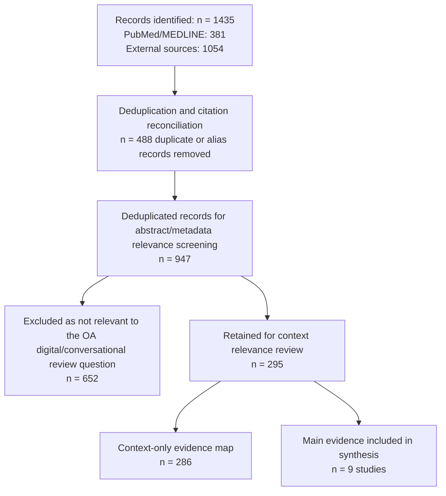

# PRISMA-Style Flow Summary

Note: Counts are reported after DOI/title deduplication and final citation reconciliation. Source-row audit files are retained for traceability but are not used as manuscript denominators. Model-assisted adjudication was used only as an internal audit aid after screening; it is not shown as a separate filtration step.
